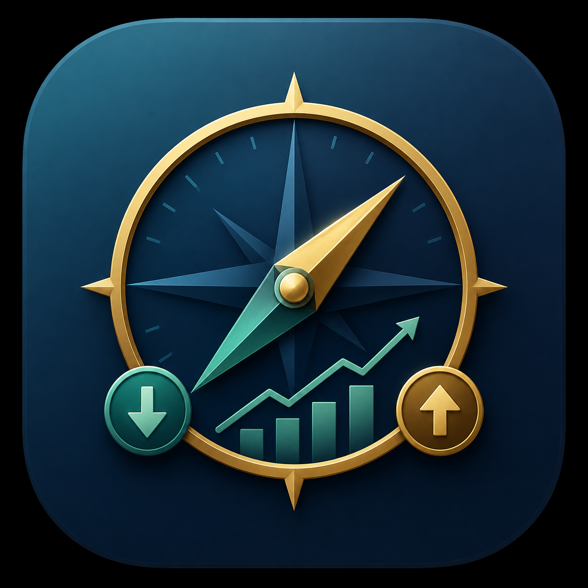

# Wealth Compass

<p align="center">
  
</p>

<p align="center">
  <a href="https://apps.apple.com/us/app/wealth-compass-tracker/id6777399748" target="_blank">
    
  </a>
</p>

Wealth Compass is a comprehensive, privacy-focused personal finance dashboard designed to give you a complete 360-degree view of your financial health. Available as a native app for **iOS and macOS**, it offers real-time tracking of assets, liabilities, and cash flow in a beautiful, local-first interface.

## 📱 Native Apple Applications

The core of Wealth Compass is a native Apple ecosystem implementation, ensuring secure, local-first tracking on your devices.

- **WealthCompassMobile**: Built with SwiftUI for iPhone, requiring iOS 17 or later.
- **WealthCompassMac**: Built with native SwiftUI for macOS 14 or later (built directly against the macOS SDK, not Mac Catalyst).

### Core Features
- 📊 **Interactive Dashboard**: Visual history of your net worth over time, asset allocation breakdowns, and key performance metrics.
- 💰 **Cash Flow Management**: Track income and expenses with categories, visual trends, and schedule recurring transaction reminders.
- 📈 **Investment Portfolio**: Real-time stock & ETF price updates via Finnhub and Yahoo Finance. Track cost basis, current value, and profit/loss.
- ₿ **Crypto Tracker**: Live data fetching from CoinGecko. Track crypto holdings and monitor live valuations.
- 🔒 **Privacy & Security**: All financial data is strictly stored locally in the app sandbox. Supports Face ID / Touch ID biometric locks and a quick-toggle Privacy Mode to blur sensitive amounts.
- 🌍 **Localization**: Fully localized in 38 languages via Xcode String Catalogs.
- 🔄 **Data Portability**: Easily export your data to a JSON backup or import existing backups. Private CloudKit synchronization is available to keep your iPhone and Mac in sync.

### Building the Apple Apps

Open `apple/WealthCompass/WealthCompass.xcodeproj` and select:
- `WealthCompassMobile` for the iPhone app
- `WealthCompassMac` for the native macOS app

For architecture and detailed build instructions, see [`apple/README.md`](./apple/README.md).

## 📁 Repository Layout

The repository holds two independent implementations of the same product, one per platform. They
share the JSON backup format, but no code.

```text
wealth-compass/
├── apple/                       Native iOS and macOS apps — see apple/README.md
│   └── WealthCompass/
│       ├── Sources/Shared/      Shared iPhone and Mac domain code
│       ├── Sources/iOS/         iPhone application and views
│       ├── Sources/macOS/       Native macOS application and views
│       ├── Resources/iOS/
│       ├── Resources/macOS/
│       └── WealthCompass.xcodeproj
├── web-app/                     Web application — see web-app/README.md
│   ├── src/                     React application source
│   ├── public/                  Web assets
│   └── package.json             Build, lint, and deploy scripts
├── DOCUMENTATION.md             Repo-wide change journal (both platforms)
└── TO_SIMO_DO.md                Repo-wide manual actions
```

---

## 🌐 Web Application (Alternative)

In addition to the native Apple apps, [`web-app/`](./web-app/) contains the source code for the
**Wealth Compass Web App**.

- **Tech Stack**: React, TypeScript, Vite, Tailwind CSS, shadcn/ui.
- **Backend & Auth**: Supabase (with Row Level Security).
- **Deployment**: Manual — `cd web-app && npm run deploy` builds the app and publishes it to the
  `gh-pages` branch, which GitHub Pages serves at
  <https://simo-hue.github.io/wealth-compass/>. There is no CI workflow.

Unlike the local-first native Apple apps, the web app relies on a centralized Supabase backend to persist its data.

### Web App Installation
- [**Web App README**](./web-app/README.md)
- [**Installation Guide (English)**](./web-app/INSTALLATION.md)
- [**Guida all'Installazione (Italiano)**](./web-app/INSTALLATION_IT.md)

---

<p align="center">
  <span style="color: #666; font-size: 0.8em;">Wealth Compass &copy; 2026</span>
</p>
